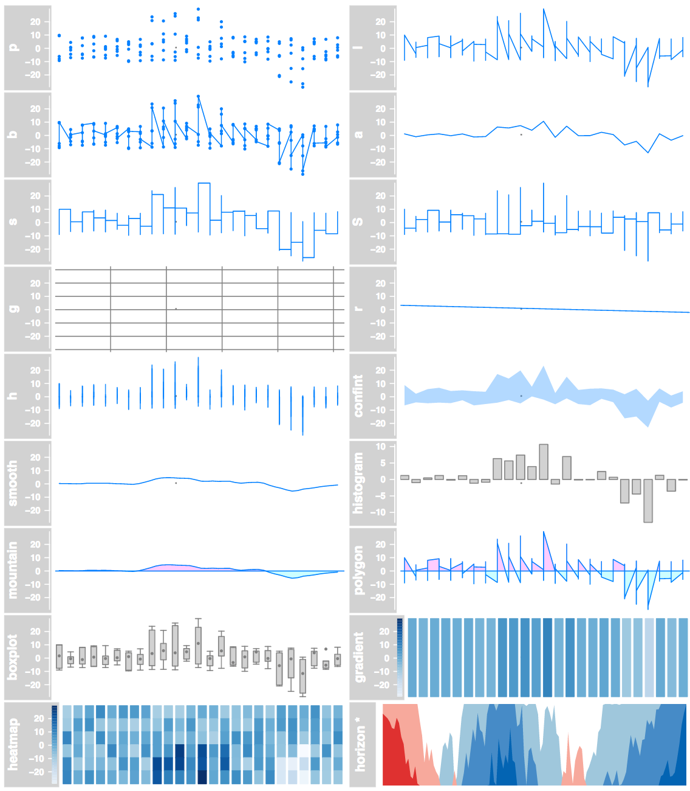

```{r, include=FALSE}
knitr::opts_chunk$set(message=FALSE, warning=FALSE, fig.height=3, tidy=TRUE, tidy.opts=list(blank=FALSE, width.cutoff=50))
```

## R, Bioconductor, Gviz

+ [R](https://www.r-project.org/) : free software environment for statistical computing and graphics.
+ [Bioconductor](http://bioconductor.org/): R packages for bioinformatics.
+ [Gviz](https://bioconductor.org/packages/release/bioc/html/Gviz.html): Package for genomic region visualization.

## Example

```{r, echo=FALSE, fig.height=5}
library(Gviz)
load("data.RData")
load("demo.RData")
from = 36400000
to =   37000000
plotTracks(list(ideoTrack, gatrack, genetrack, dtrack, atrack, qtrack), from=from, to=to, sizes=c(1,1,4,1,4,4))
```

## Important functions

+ `IdeogramTrack`: Chromosome ideogram
+ `GenomeAxisTrack`: An axis
+ `GeneRegionTrack`: Same but for genes
+ `AnnotationTrack`: Ranges annotation
+ `DataTrack`: Different types of graphs

+ `plotTracks` merges different tracks.

## Simple example

```{r}
## Let's say we have 'gr' and 'qtls' GRanges
library(Gviz)
atrack = AnnotationTrack(cnv, name="CNVs")
gatrack = GenomeAxisTrack()
qtrack = DataTrack(qtls, data=qtls$logPv, name="QTLs")
plotTracks(list(gatrack, atrack, qtrack))
```

## Data tracks {#myImagePage}




## Data track

```{r}
qtrack = DataTrack(qtls, data=qtls$logPv, name="QTLs", type="h")
plotTracks(qtrack)
```

## Chromosome ideogram and axis

```{r}
ideoTrack <- IdeogramTrack(genome = "hg19", chromosome = "chr21")
gatrack = GenomeAxisTrack()
plotTracks(list(ideoTrack, gatrack, qtrack))
```

## Gene model

I downloaded Gencode annotation and parsed it to look like this

```{r}
load("gencode.v25.ch21.RData")
gencode[1]
```

## Gene model track

```{r}
from = 36400000
to =   37000000
genetrack <- GeneRegionTrack(gencode, genome = "hg19", name = "Gene", transcriptAnnotation="symbol")
plotTracks(genetrack, from=from, to=to)
```

## Joining the tracks

```{r, fig.height=4}
plotTracks(list(ideoTrack, gatrack, genetrack, qtrack), from=from, to=to)
```

## UCSC tracks

UCSC tracks can be imported directly, but for some reason it's slow.

```{r, eval=FALSE}
ucscGenes <- UcscTrack(genome="hg19", chromosome="chr21", from=min(start(gr)), to=max(end(gr)), track="knownGene", trackType="GeneRegionTrack", rstarts="exonStarts", rends="exonEnds", gene="name", symbol="name", transcript="name", strand="strand", fill="#8282d2", name="UCSC Genes")
plotTracks(list(gatrack, atrack))
```

## Demo - Custom annotations

+ Color using the `feature` argument.
+ Group using the `group` argument.

```{r, echo=FALSE, fig.height=4}
load("demo.RData")
plotTracks(list(ideoTrack, gatrack, genetrack, dtrack, atrack, qtrack), from=from, to=to, sizes=c(1,1,4,1,4,4))
```

## Other examples - Read Alignment

```{r, echo=FALSE, fig.height=5}
afrom <- 2960000
ato <- 3160000
```

```{r}
alTrack <- AlignmentsTrack(system.file(package = "Gviz", "extdata", "gapped.bam"), isPaired = TRUE)
```

```{r, echo=FALSE, fig.height=4}
bmt <- BiomartGeneRegionTrack(genome = "hg19", chromosome = "chr12", start = afrom, end = ato, filter = list(with_ox_refseq_mrna = TRUE), stacking = "dense")
plotTracks(c(bmt, alTrack), from = afrom + 12700, to = afrom + 15200, chromosome = "chr12")
```

## Other examples - Read Alignment

```{r, fig.height=4}
plotTracks(c(bmt, alTrack), from = afrom + 12700, to = afrom + 15200, chromosome = "chr12", type = c("coverage", "sashimi"))
```

## Other examples - Read Alignment

```{r, echo=FALSE, fig.height=5}
alTrack <- AlignmentsTrack(system.file(package = "Gviz", "extdata", "snps.bam"), isPaired = TRUE)
library(BSgenome.Hsapiens.UCSC.hg19)
strack <- SequenceTrack(Hsapiens)
plotTracks(c(alTrack,strack), chromosome = "chr21", from = 44946590, to = 44946660, cex = 0.5, min.height = 8)
```

## Links

+ [Gviz manual](https://bioconductor.org/packages/release/bioc/vignettes/Gviz/inst/doc/Gviz.pdf).
+ [STHDA Wiki page](http://www.sthda.com/english/wiki/gviz-visualize-genomic-data).
+ [Slides from a Bioconductor course](https://www.bioconductor.org/help/course-materials/2012/BiocEurope2012/GvizEuropeanBioc2012.pdf).

