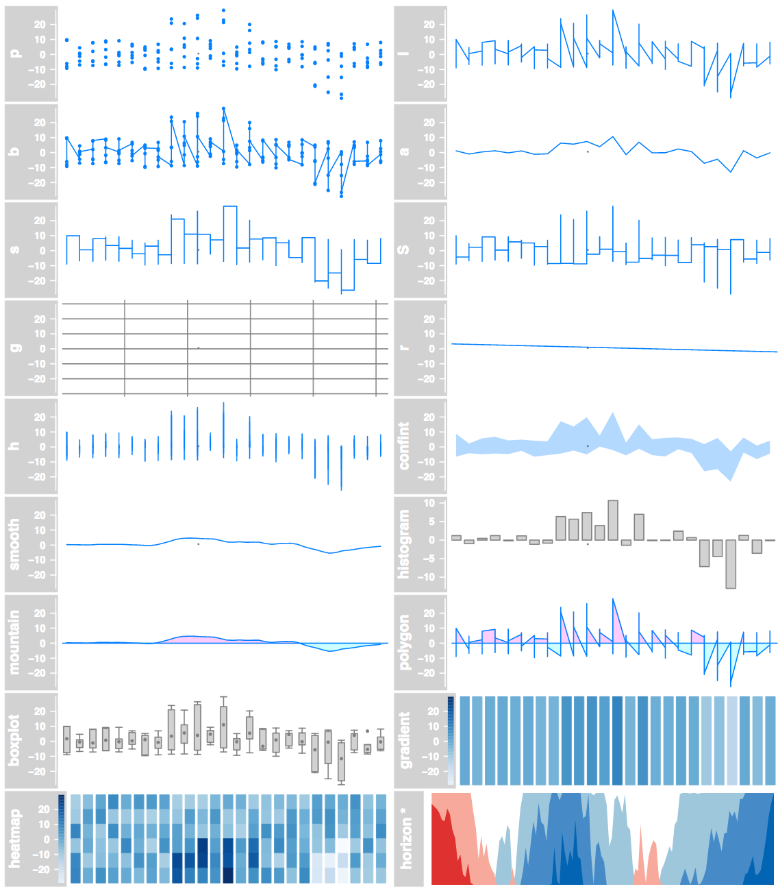

R, Bioconductor, Gviz
---------------------

-   [R](https://www.r-project.org/) : free software environment for
    statistical computing and graphics.
-   [Bioconductor](http://bioconductor.org/): R packages for
    bioinformatics.
-   [Gviz](https://bioconductor.org/packages/release/bioc/html/Gviz.html):
    Package for genomic region visualization.

Example
-------

Important functions
-------------------

-   `IdeogramTrack`: Chromosome ideogram
-   `GenomeAxisTrack`: An axis
-   `GeneRegionTrack`: Same but for genes
-   `AnnotationTrack`: Ranges annotation
-   `DataTrack`: Different types of graphs

-   `plotTracks` merges different tracks.

Simple example
--------------

    ## Let's say we have 'cnv' and 'qtls' GRanges
    library(Gviz)
    atrack = AnnotationTrack(cnv, name = "CNVs")
    gatrack = GenomeAxisTrack()
    qtrack = DataTrack(qtls, data = qtls$logPv, name = "QTLs")
    plotTracks(list(gatrack, atrack, qtrack))

Data tracks
-----------

Data track
----------

    qtrack = DataTrack(qtls, data = qtls$logPv, name = "QTLs", 
        type = "h")
    plotTracks(qtrack)

Chromosome ideogram and axis
----------------------------

    ideoTrack = IdeogramTrack(genome = "hg19", chromosome = "chr21")
    gatrack = GenomeAxisTrack()
    plotTracks(list(ideoTrack, gatrack, qtrack))

Gene model
----------

I downloaded [Gencode](https://www.gencodegenes.org/) annotation and
parsed it to look like this

    load("gencode.v25.ch21.RData")
    gencode[1]

    ## GRanges object with 1 range and 3 metadata columns:
    ##       seqnames             ranges strand |        feature
    ##          <Rle>          <IRanges>  <Rle> |    <character>
    ##   [1]    chr21 [5011799, 5011874]      + | protein_coding
    ##              transcript      symbol
    ##             <character> <character>
    ##   [1] ENST00000624081.1 CH507-9B2.2
    ##   -------
    ##   seqinfo: 25 sequences from an unspecified genome; no seqlengths

Gene model track
----------------

    from = 36400000
    to = 37000000
    genetrack = GeneRegionTrack(gencode, genome = "hg19", 
        name = "Gene", transcriptAnnotation = "symbol")
    plotTracks(genetrack, from = from, to = to)

Joining the tracks
------------------

    plotTracks(list(ideoTrack, gatrack, genetrack, qtrack), 
        from = from, to = to)

UCSC tracks
-----------

UCSC tracks can be imported directly, but for some reason it's slow.

    ucscGenes = UcscTrack(genome = "hg19", chromosome = "chr21", 
        from = min(start(gr)), to = max(end(gr)), track = "knownGene", 
        trackType = "GeneRegionTrack", rstarts = "exonStarts", 
        rends = "exonEnds", gene = "name", symbol = "name", 
        transcript = "name", strand = "strand", fill = "#8282d2", 
        name = "UCSC Genes")
    plotTracks(list(gatrack, atrack))

Demo - Custom annotations
-------------------------

-   Color using the `feature` argument.
-   Group using the `group` argument.

Other examples - Read Alignment
-------------------------------

    alTrack = AlignmentsTrack(system.file(package = "Gviz", 
        "extdata", "gapped.bam"), isPaired = TRUE)

Other examples - Read Alignment
-------------------------------

    plotTracks(c(bmt, alTrack), from = afrom + 12700, to = afrom + 
        15200, chromosome = "chr12", type = c("coverage", 
        "sashimi"))

Other examples - Read Alignment
-------------------------------

Links
-----

-   [Gviz
    manual](https://bioconductor.org/packages/release/bioc/vignettes/Gviz/inst/doc/Gviz.pdf).
-   [STHDA Wiki
    page](http://www.sthda.com/english/wiki/gviz-visualize-genomic-data).
-   [Slides from a Bioconductor
    course](https://www.bioconductor.org/help/course-materials/2012/BiocEurope2012/GvizEuropeanBioc2012.pdf).
